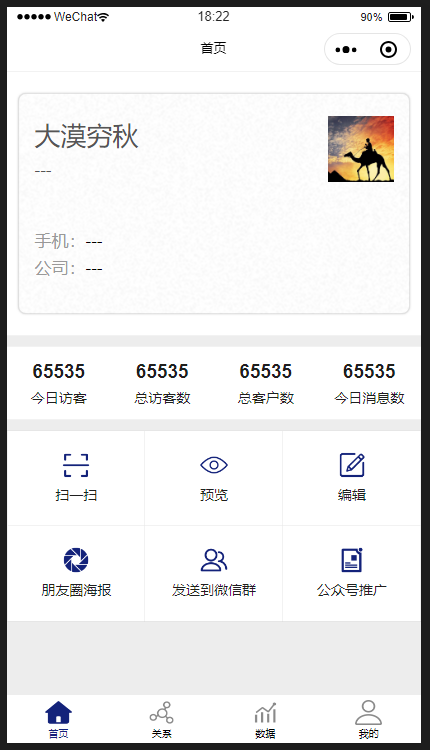
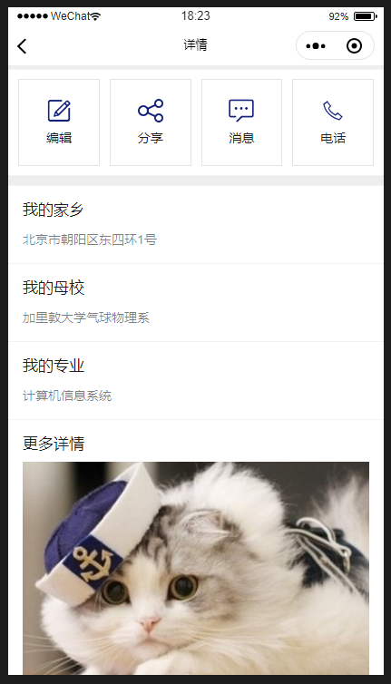
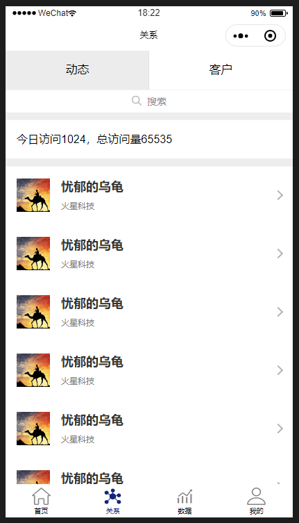
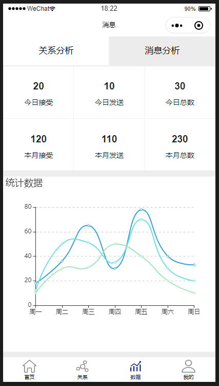
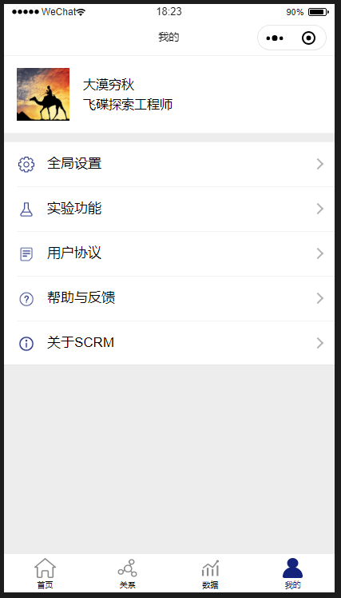

# SCRM 小程序

## 用法

- git 拉取此项目代码到你本地
- 在微信开发者工具中打开此项目根目录
- 注意：务必填写你自己预先申请好的appid，而不要使用我的appid
- 在微信开发者工具中打开“云开发”->“数据库”控制台，导入docs目录下的数据结构

## 已完成功能

- 首页
- 名片详情页
- 编辑基本信息
- 编辑图文混排详情
- 列表页
- Echarts图形页
- 调用原生API的一些功能：扫一扫、打电话、分享到朋友圈等

## 效果截图

## 参考文档

- [云开发文档](https://developers.weixin.qq.com/miniprogram/dev/wxcloud/basis/getting-started.html)

## License
MIT.
（特别备注：您可以随意使用此项目的代码，不需要预先告知我，包括用于商业用途。如果因为您使用此项目产生任何违法或有害行为，与本人无关，由您自己负责。）
